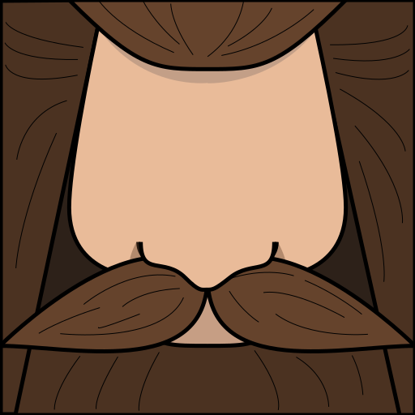

# HAGRID
<a href="#"></a>
Hagrid is a JavaScript library for removing overlaps in scatterplots. When using glyphs or images instead of points in a scatterplot, overlaps happen which impedes the readability of the scatterplot. Hagrid uses space filling curves to remove the overlaps in such a scatterplot.

## Installation
If you use npm, install with `npm install @saehrimnir/hagrid`, and use it with
```js
import * as hagrid from "@saehrimnir/hagrid";
```

## Usage

Hagrid provides a method `gridify`:

```js
let gridified_data = hagrid.gridify(data, method, parameters);
```

or use the method directly:

```js
let gridified_data = hagrid.gridify_hilbert(data, parameters);
let gridified_data = hagrid.gridify_gosper(data, parameters);
let gridified_data = hagrid.gridify_dgrid(data, parameters);
let gridified_data = hagrid.gridify_cmds(data, parameters);
let gridified_data = hagrid.gridify_nmap(data, parameters);
```

### Methods & Parameters
The methods 'hilbert' and 'gosper' are ours, 'dgrid', 'cmds', and 'nmap' are reimplementations or translations of other techniques.

| name | description | parameters | link |
| ---- | ---- | ---- | ---- |
| hilbert | uses the hilbert curve, produces rectangular grid cells | pluslevel = 0 or whitespace, keep_aspect_ratio |... | 
| gosper | uses the gosper curve, produces hexagonal grid cells | pluslevel = 0 or whitespace, scale_factor | ... |
| dgrid | fills the whole visualization area, keeping an given aspect ratio of the grid cells. | aspect ratio = 1 | ... |
| cmds | similar to mds but with constraints | alpha, Gamma, size | ... |
| nmap | a space filling treemap approach | none | ... |


